### 1.	Jalankan setiap langkah dari materi diatas, tuliskan pemahaman anda.
```sql
SELECT * FROM orders WHERE customer_id = 1001;
```

```sql
BEGIN;
UPDATE accounts SET balance = balance - 100 WHERE id = 1;
UPDATE accounts SET balance = balance + 100 WHERE id = 2;
COMMIT;
```
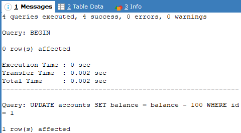
 
```sql
SELECT * FROM users;
```
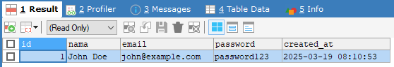
  
```sql
SELECT id, nama, email FROM users;
```
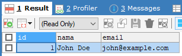
 
- Menambahkan Indeks pada Kolom yang Sering Digunakan dalam WHERE dan JOIN Cara Menambahkan Indeks:
  - Indeks pada Kolom WHERE
    - Query:
      ```sql
      CREATE INDEX idx_nama ON users(nama);
      ```
      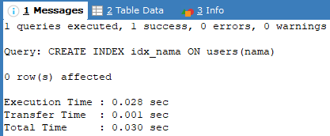
 
  -	Indeks pada Kolom yang Digunakan dalam JOIN
    - Query:
      ```sql
      CREATE INDEX idx_customer_id ON orders(customer_id);
      ```
      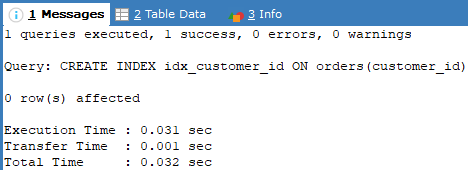
 
  -	Indeks Multi-Kolom untuk Query yang Melibatkan Beberapa Kolom
    ```sql
    Query: CREATE INDEX idx_multi ON orders(customer_id, status);
    ```
    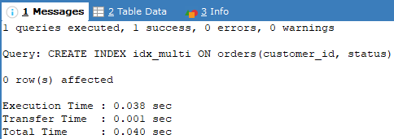
 
- Mengevaluasi efektivitas indeks
  - Query:
    ```sql
    EXPLAIN SELECT * FROM users WHERE nama = 'John';
    ```
    
 
### 2.	Pada database minimartket, pada table tr_penjualan_raw, lakukan optimasi dengan menggunakan tehnik diatas. Gunakan index dan query chace.
- Menambahkan Indeks
  - Berdasarkan tgl_transaksi
    - Query:
      ```sql
      CREATE INDEX idx_tgl_transaksi ON tr_penjualan_raw(tgl_transaksi);
      ```
      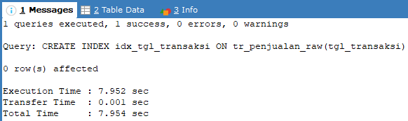

  -	Berdasarkan kode_item
    - Query:
      ```sql
      CREATE INDEX idx_kode_item ON tr_penjualan_raw(kode_item);
      ```
      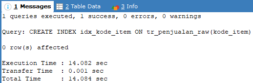
 
### 3.	Query berikut apakah sudah optimal?? Jika belum, lakukan optimasi.
```sql
SELECT * FROM tr_penjualan_raw WHERE YEAR(tgl_transaksi) = 2008;
```
 

- Optimasi:
  - Gunakan range data Query:
    ```sql
    SELECT * FROM tr_penjualan_raw
    WHERE tgl_transaksi BETWEEN '2008-01-01' AND '2008-12-31';
    ```
    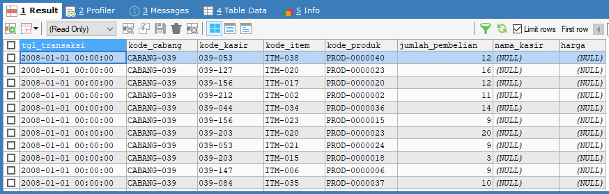
    
### 4.	Query berikut apakah sudah optimal?? Jika belum, lakukan optimasi
```sql
SELECT * FROM tr_penjualan_raw WHERE kode_item IN ('IT003', 'IT004', 'IT005', 'IT006', 'IT007', 'IT008', 'IT009', 'IT010', 'IT011', 'IT012');
```
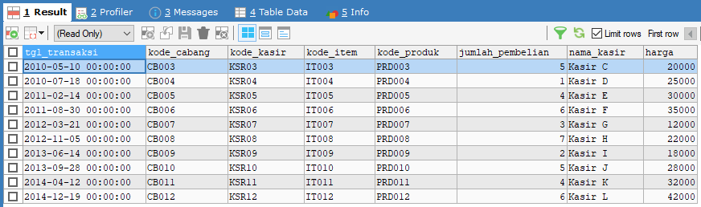
 
### 5.	Query berikut apakah sudah optimal?? Jika belum, lakukan optimasi
```sql
SELECT * FROM tr_penjualan_raw WHERE nama_kasir LIKE '%John%';
```
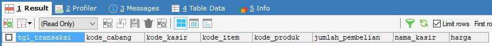

- Optimasi
  - Query:
    ```sql
    ALTER TABLE tr_penjualan_raw ADD FULLTEXT(nama_kasir);
    ```
    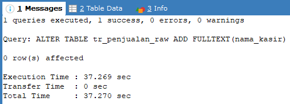
    
- Ubah query:
  ```sql
  SELECT * FROM tr_penjualan_raw WHERE MATCH(nama_kasir) AGAINST ('John' IN NATURAL LANGUAGE MODE);
  ```
  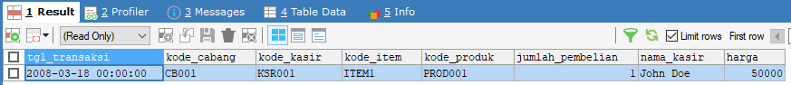
  
### 6.	Diberikan query berikut. Pada kolom harga belum ada index. Apakah query berikut sudah optimal?? Jelaskan langkah2 optimasinya.
```sql
SELECT MAX(harga) FROM tr_penjualan_raw WHERE kode_cabang = 'CB001';
```
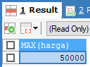
