# KONFIGURASI MYSQL

## Latar Belakang
MySQL adalah sistem manajemen basis data relasional (RDBMS) yang banyak digunakan di berbagai sistem informasi. Sebagai mahasiswa yang belajar tentang database, memahami cara menginstal dan mengonfigurasi MySQL adalah keterampilan penting untuk memastikan sistem bekerja optimal dan aman.

## Problem yang Diangkat
1. Bagaimana cara menginstal MySQL dengan benar?
2. Bagaimana cara mengelola user dan hak akses dalam MySQL?
3. Bagaimana cara membuat dan mengelola database?
4. Bagaimana cara melakukan konfigurasi dasar MySQL untuk meningkatkan performa?

## Solusi/Skenario Aktivitas (Soal yang Dikerjakan)

### 1.	Jelaskan tentang database relational, database unrelational dan berikan contoh produknya masing-masing 3!

   - Database Relational

      - Database relational adalah jenis database yang menyimpan data dalam bentuk tabel dengan baris dan kolom, serta memiliki hubungan antar tabel menggunakan kunci primer dan kunci asing.
   
      - Contoh produk database relational:
         - MySQL
         - PostgreSQL
         - Microsoft SQL Server

   - Database Unrelational (NoSQL)

      - Database unrelational adalah database yang tidak menggunakan model tabel, tetapi menggunakan format seperti dokumen, key-value, grafik, atau column-family. Database ini lebih fleksibel dalam menangani data yang tidak terstruktur.
      
      - Contoh produk database unrelational:
         - MongoDB (document-based)
         - Redis (key-value store)
         - Cassandra (column-family store)

### 2. Jelaskan kapan harus menggunakan database relational dan kapan harus menggunakan  database unrelational 

   - Gunakan database relational jika:

     - Data memiliki struktur yang tetap dan hubungan yang kuat antar tabel.
     - Dibutuhkan transaksi yang kuat dengan dukungan ACID (Atomicity, Consistency, Isolation, Durability).
     - Data harus di-query dengan bahasa SQL secara kompleks.

   - Gunakan database unrelational jika:
      - Data bersifat tidak terstruktur atau semi-terstruktur (misalnya JSON atau XML).
      - Dibutuhkan performa tinggi untuk skala besar dengan banyak data yang berubah secara cepat.
      - Tidak diperlukan transaksi ACID yang ketat dan lebih mengutamakan skalabilitas horizontal.

### 3.	Lakukan instalasi database mysql dari awal sampai akhir.

### 4.	Pastikan dalam setiap tahapan instalasi, didokumentasikan dalam bentuk screenshot untuk  bahan Menyusun laporan 
- Buka website MySQL lalu pilih menu downloads
  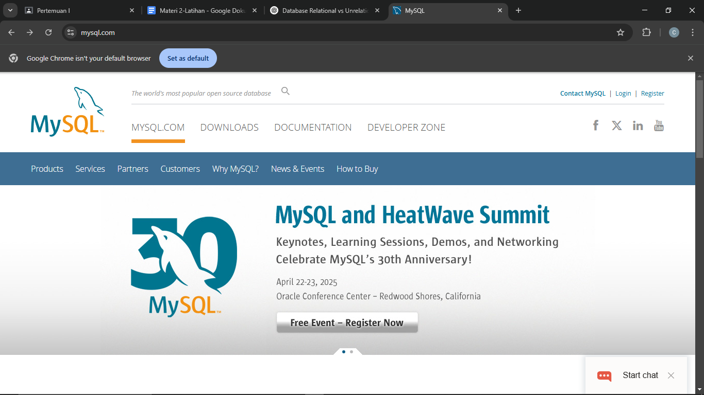
- Scroll ke bawah sampai menemukan MySQL Community
  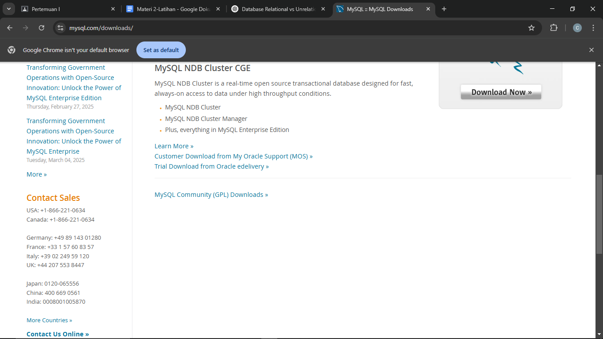
- Pilih MySQL Installer for Windows
  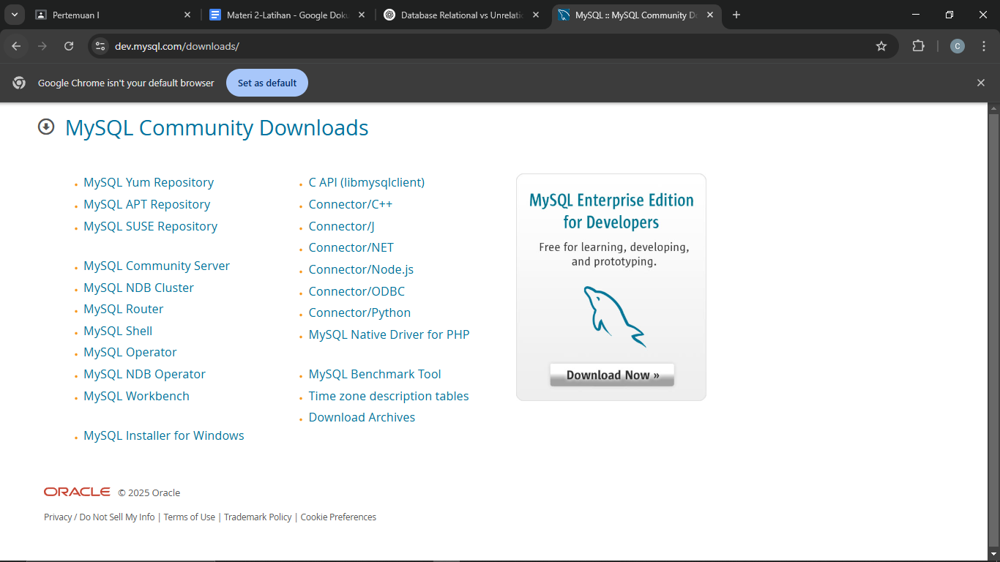
- Pilih yang bawah lalu klik download
  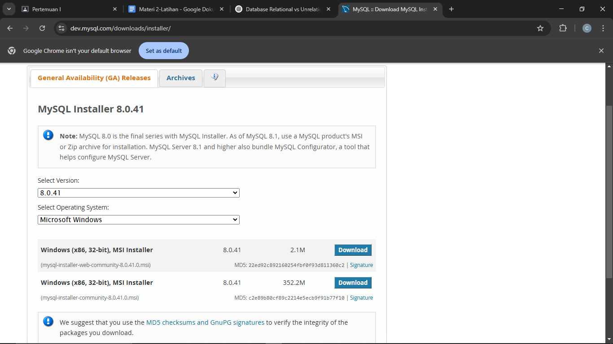
- Klik No thanks
  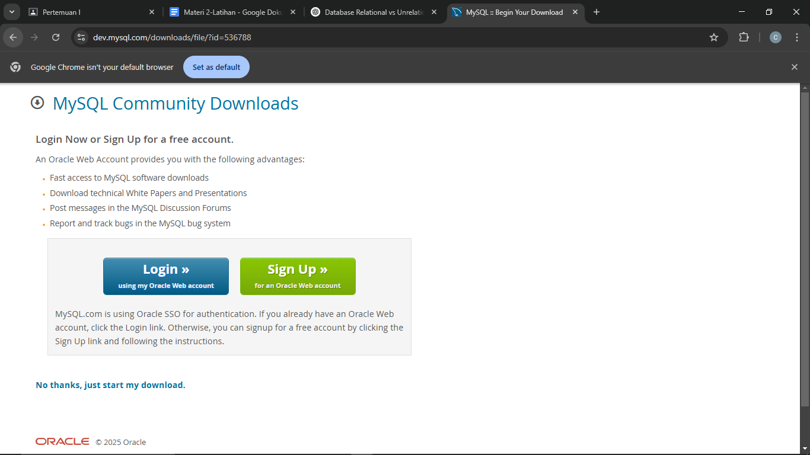
- Akan muncul notifikasi tersebut lalu klik start download
  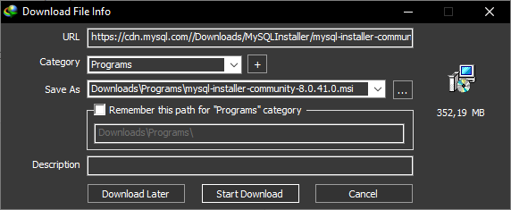
- Setelah terdownload akan tampil seperti berikut lalu klik open
  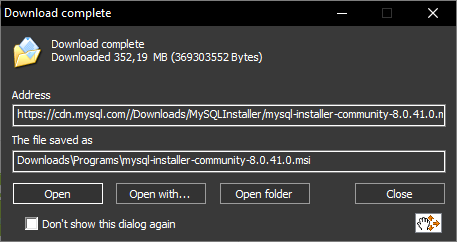
- Klik yes saja jika muncul tampilan pada windows
- Setelah itu MySQL akan otomatis terbuka lalu pilih server only dan klik next
  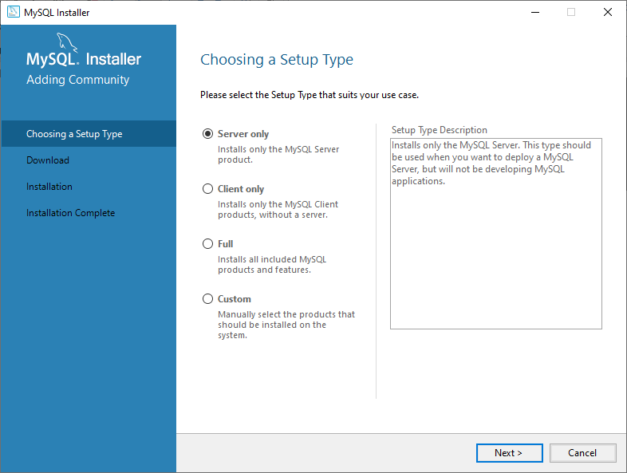
- Klik execute maka product akan terdownload setelah itu klik next terus sampai muncul form untuk mengisi password
  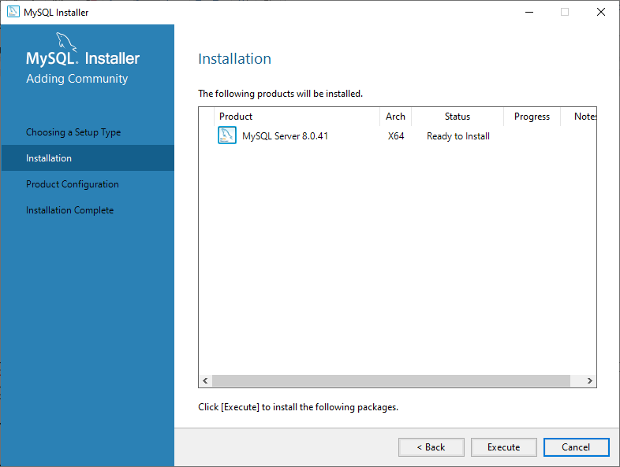
- Masukkan password lalu next terus
  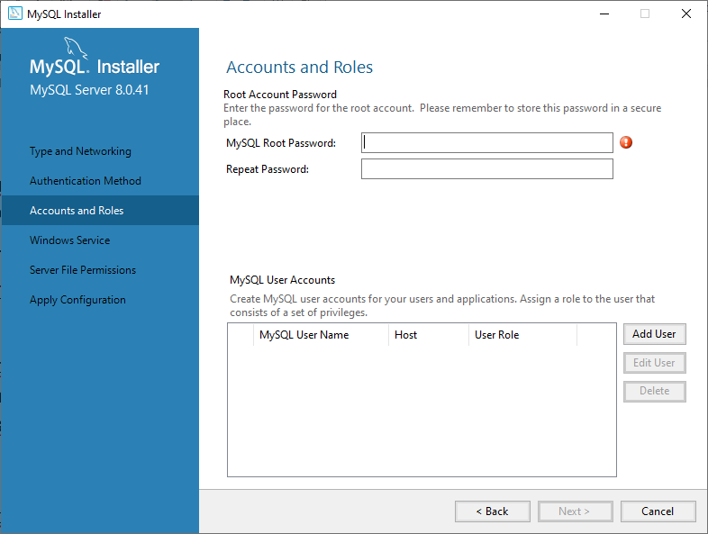
- Klik execute lalu finish, next lagi lalu finish lagi maka mysql sudah terinstall
  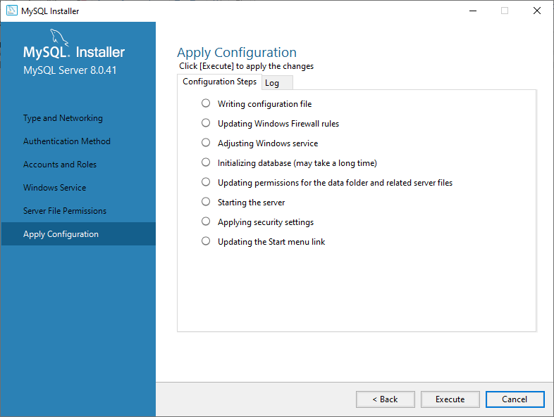
- Search mysql 8.0 command line client untuk menyetting
  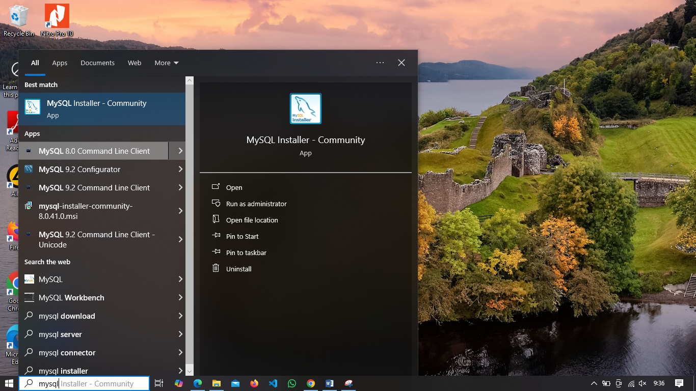
- Masukkan password yang sudah dimasukkan tadi setelah itu kita sudah masuk ke dalam root mysql
  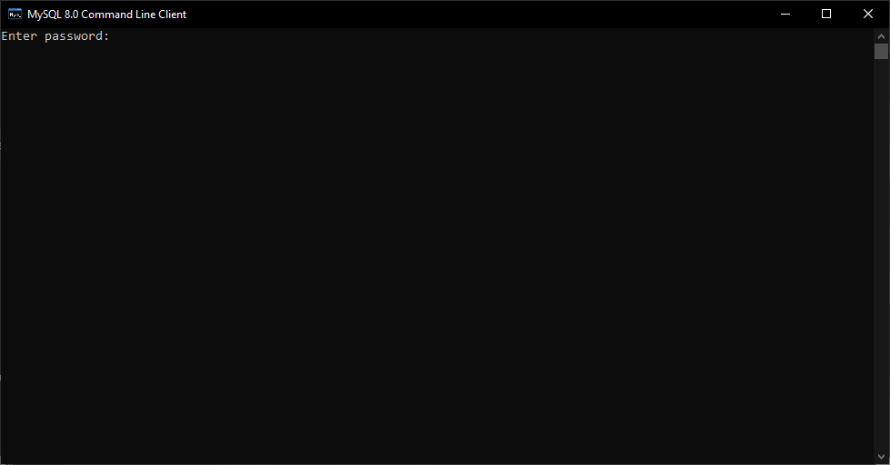

### 5. Lakukan perubahan perubahan pada variable berikut (dokumentasikan before dan after nya)
- port dari default 3306 menjadi 3309. 
  - Ketik perintah SHOW VARIABLES LIKE ‘port’; di command prompt mysql untuk mengecek port yang sedang digunakan lalu tekan enter dan hasilnya akan menunjukkan port saat ini (biasanya 3306). Lalu tutup mysql dengan perintah EXIT; dan enter
    
  - Buka file my.ini menggunakan vscode, ganti port menjadi 3309
    
  - Buka cmd administrator lalu ketikkan net stop mysql80 dan net start mysql80 seperti pada gambar
    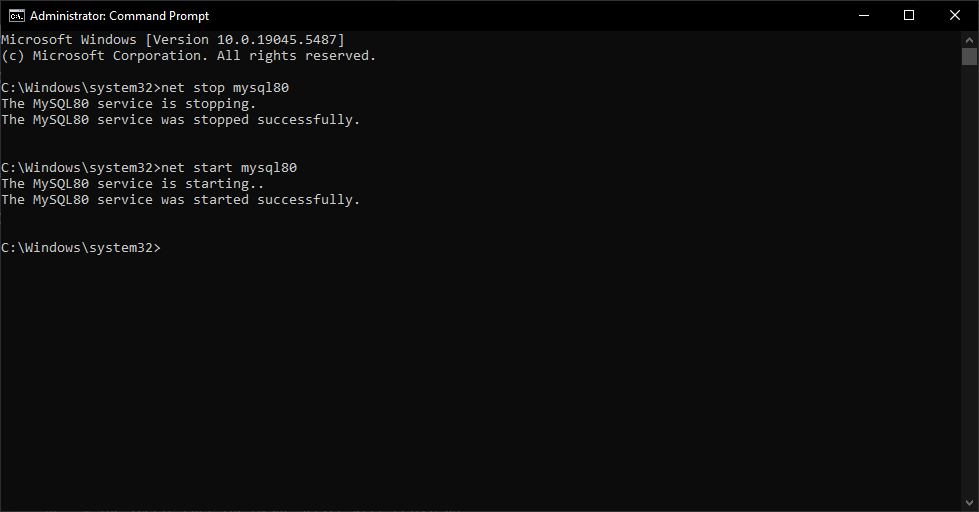
    - Sesudah
      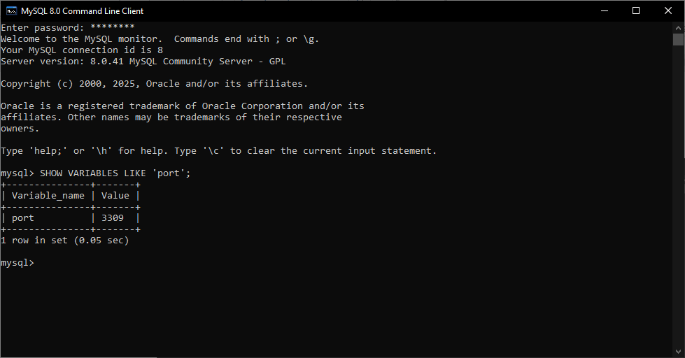

- innodb_buffer_pool_size dr default 16M (menjadi 25% dari RAM )
  - Cek size
    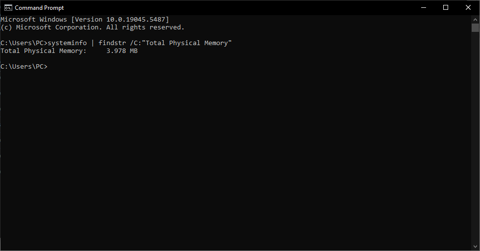
  - Buka File “C:\ProgramData\MySQL\MySQL Server 8.0\my.ini” dan rubah innodb_buffer_pool_size. Karena ram saya 4 gb jadi 25% dari 4 GB adalah 1GB.
    
  - Cek di CMD
    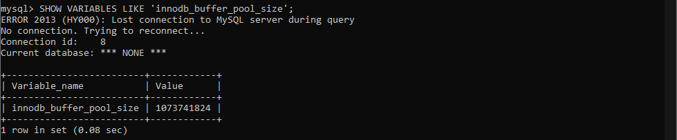
  - Restart MySQL
    
	 
### 6. lakukan perubahan terhadap password root. 
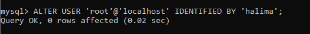
### 7. Buat database dengan nama: kelompok_AB_nama_mhs 
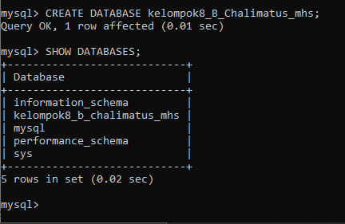
### 8. Semua Langkah-langkah konfigurasi diatas, lakukan dengan command prompt. 

## Pembahasan
Dalam konfigurasi MySQL, ada beberapa aspek penting:
1. Port konfigurasi: Mengubah port membantu menghindari konflik dengan aplikasi lain.
2. Buffer pool size: Menyesuaikan ukuran buffer membantu meningkatkan performa MySQL, terutama dalam menangani data besar.
3. Manajemen user: Mengatur hak akses user sangat penting untuk menjaga keamanan database.

## Kesimpulan
Konfigurasi MySQL tidak hanya sebatas instalasi tetapi juga mencakup pengelolaan database dan user agar lebih optimal dan aman. Pemahaman dasar ini menjadi landasan penting dalam penggunaan MySQL di dunia nyata.
