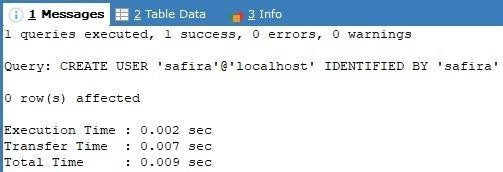

# MANAJEMEN USER DAN ROLE

## Latar Belakang
Dalam sistem basis data, manajemen pengguna (user), peran (role), dan hak akses (privilege) sangat penting untuk menjaga keamanan dan keteraturan sistem. Dengan adanya pengelolaan user dan role, administrator basis data dapat mengatur siapa yang dapat mengakses, mengubah, atau menghapus data. Praktikum ini bertujuan untuk memahami bagaimana membuat, mengelola, serta menguji pengguna dan hak akses dalam MysQL.

## Problem yang Diangkat
1. Bagaimana cara membuat, menghapus, dan melihat daftar user dalam MySQL?
2. Bagaimana cara memberikan hak akses tertentu kepada user melalui role?
3. Bagaimana cara menguji apakah role yang diberikan telah berfungsi dengan benar?
4. Bagaimana cara mencabut role dari user agar mereka tidak memiliki hak akses tertentu?
5. Bagaimana cara memonitor aktivitas pengguna dalam MySQL melalui log?

## Solusi/Skenario Aktivitas (Soal yang Dikerjakan)

### 1. Lakukan proses pembuatan username sebanyak jumlah kelompok Anda! Tuliskan script dan tampilkan hasilnya!

-	Membuat tiga user baru dalam database MySQL dengan nama chalimatus, safira, dan sherli, masing-masing hanya dapat mengakses dari localhost.
-	Code :
  ```sql
  CREATE USER 'chalimatus'@'localhost' IDENTIFIED BY 'chalimatus';
  ```
  
- Code :
  ```sql
  CREATE USER 'safira'@'localhost' IDENTIFIED BY 'safira';
  ```
  
- Code :
  ```sql
  CREATE USER 'sherli'@'localhost' IDENTIFIED BY 'sherli';
  ```
  
-	Menampilkan daftar user beserta host yang diizinkan untuk mengakses database.
- Code :
  ```sql
  SELECT USER, HOST FROM mysql.user WHERE USER IN ('chalimatus', 'safira', 'sherli');
  ```
  

### 2. Lakukan penghapusan username terhadap user yang sudah dibuat. Tuliskan script dan tampilkan hasilnya

- Menghapus user sherli dari MySQL
- Code :
  ```sql
  DROP USER 'sherli'@'localhost';
  ```
  
- Mengecek kembali daftar user yang masih ada setelah penghapusan user sherli.
- Code :
  ```sql
  SELECT USER, HOST FROM mysql.user WHERE USER IN ('chalimatus', 'safira', 'sherli');
  ```
  

### 3. Buat role dengan "role_nama_anda_insert_select" -> role_andi_select_insert

-	Membuat role bernama role_chalimatus_insert_select.
-	Code :
  ```sql
  CREATE ROLE 'role_chalimatus_insert_select';
  ```
  

### 4. Berikan privilege select, insert ke dalam role di atas

-	Memberikan izin SELECT dan INSERT pada seluruh tabel di database_example untuk role role_chalimatus_insert_select.
-	Code :
  ```sql
  GRANT SELECT, INSERT ON database_example.* TO 'role_chalimatus_insert_select';
  ```
  
  
### 5. Buat role dengan "role_nama_anda_create_drop" -> role_andi_create_drop

-	Membuat role bernama role_chalimatus_create_drop.
-	Code :
  ```sql
  CREATE ROLE 'role_chalimatus_create_drop';
  ```
  
  
### 6. Berikan privilege create, drop kedalam role diatas

-	Memberikan izin CREATE dan DROP pada seluruh tabel di database_example untuk role role_chalimatus_create_drop.
-	Code :
  ```sql
  GRANT CREATE, DROP ON database_example.* TO 'role_chalimatus_create_drop';
  ```
  
  
### 7. Berikan 2 user kedalam masing-masing role diatas.

-	Memberikan role role_chalimatus_insert_select kepada chalimatus dan safira.
-	Code :
  ```sql
  GRANT 'role_chalimatus_insert_select' TO 'chalimatus'@'localhost', 'safira'@'localhost';
  ```
  

-	Mengecek kembali daftar user yang memiliki hak akses tertentu.
-	Code :
    ```sql
    SELECT USER, HOST FROM mysql.user WHERE USER IN ('chalimatus', 'safira', 'sherli');
    ```
  

### 8. Lakukan pengujian sebelum dan sesudah user diberikan role.

-	Menampilkan daftar hak akses (privilege) yang dimiliki oleh user chalimatus dan safira.
-	Code :
  ```sql
  SHOW GRANTS FOR 'chalimatus'@'localhost';
  ```
  
- Code :
  ```sql
  SHOW GRANTS FOR 'safira'@'localhost';
  ```
  

-	Mengaktifkan peran yang telah diberikan untuk sesi pengguna saat ini.
-	Code :
  ```sql
  SET ROLE 'role_chalimatus_insert_select';
  ```
  
- Code :
  ```sql
  SET ROLE 'role_chalimatus_create_drop';
  ```
  

- Menampilkan kembali hak akses user setelah role diterapkan.
- Code :
    ```sql
    SHOW GRANTS FOR 'chalimatus'@'localhost';
    ```
    
- Code :
  ```sql
  SHOW GRANTS FOR 'safira'@'localhost';
  ```
  
  
### 9. Lepas role dari user diatas. Sehingga user menjadi tidak memiliki role.

-	Menghapus role role_chalimatus_create_drop dari safira dan sherli.
-	Code :
  ```sql
  REVOKE 'role_chalimatus_create_drop' FROM 'safira'@'localhost', 'sherli'@'localhost';
  ```
  

-	Menampilkan hak akses user setellah role di terapkan, dengan code:
  ```sql
  SHOW GRANTS FOR chalimatus@'localhost;
  ```
  

-	Mengecek kembali daftar hak akses user setelah role dicabut.
-	Code :
  ```sql
  SHOW GRANTS FOR 'safira'@'localhost';
  ```
  

### 10. Lakukan konfigurasi untuk proses monitoring proses seperti contoh diatas, dan lakukan beberapa kali proses query. Kemudian lihat di log nya dan tampilkan hasilnya.

-	Mengaktifkan general log MySQL dan mengatur output log ke dalam tabel database MySQL.
-	Code :
  ```sql
  SET GLOBAL general_log = 1;
  ```
  
-	Code :
  ```sql
  SET GLOBAL log_output = 'TABLE';
  ```
  

-	Menampilkan 10 log aktivitas terakhir yang terekam dalam mysql.general_log.
-	Code :
  ```sql
  SELECT * FROM mysql.general_log ORDER BY event_time
DESC LIMIT 10;
  ```
  
Output ada beberapa kolom yaitu event_time : menampilan tanggal dan jam; user_host nya yaitu root, localhost serta kode; thread_id yaitu 8; server_id yaitu 1; command_type yaitu query; dan argument yaitu menyesuaikan yang kita insertkan beserta kode.

### 11.	Tulis kesimpulan dari kegiatan praktek kelompok anda.

- Manajemen Akun Pengguna
  -	Berhasil membuat, melihat, dan menghapus user dalam MySQL.

- Manajemen Hak Akses dan Role
  -	Berhasil membuat role dan memberikan hak akses (privilege) seperti SELECT, INSERT, CREATE, dan DROP.
  -	Role berhasil diberikan ke user dan diuji sebelum serta sesudah pemberian role.
   -	Role juga berhasil dicabut dari user untuk memastikan mereka kembali tanpa hak akses yang diberikan.

- Monitoring Akses dan Aktivitas Pengguna
  -	Berhasil mengaktifkan general log untuk mencatat aktivitas database.
  -	Dapat melihat log dari query yang dijalankan seperti SELECT, INSERT, CREATE, dan DROP.

### Kesimpulan Keseluruhan:
Menunjukkan bagaimana mengelola pengguna, role, dan hak akses dalam MySQL secara efektif, serta bagaimana melakukan monitoring aktivitas database untuk keamanan dan audit.

## Pembahasan
Praktikum ini menunjukkan langkah-langkah penting dalam manajemen user dan role dalam MySQL. Berikut adalah detail implementasi:

- Pembuatan User
```sql
CREATE USER 'chalimatus'@'localhost' IDENTIFIED BY 'chalimatus';
CREATE USER 'safira'@'localhost' IDENTIFIED BY 'safira';
CREATE USER 'sherli'@'localhost' IDENTIFIED BY 'sherli';
```

- Pembuatan Role
```sql
CREATE ROLE 'role_chalimatus_insert_select';
CREATE ROLE 'role_chalimatus_create_drop';
```

- Pemberian Hak Akses ke Role
```sql
GRANT SELECT, INSERT ON database_example.* TO 'role_chalimatus_insert_select';
GRANT CREATE, DROP ON database_example.* TO 'role_chalimatus_create_drop';
```

- Pemberian Role ke User
```sql
GRANT 'role_chalimatus_insert_select' TO 'chalimatus'@'localhost', 'safira'@'localhost';
GRANT 'role_chalimatus_create_drop' TO 'safira'@'localhost', 'sherli'@'localhost';
```

- Penghapusan Role dari User
```sql
REVOKE 'role_chalimatus_create_drop' FROM 'safira'@'localhost', 'sherli'@'localhost';
```

- Monitoring Aktivitas
```sql
SET GLOBAL general_log = 1;
SET GLOBAL log_output = 'TABLE';
SELECT * FROM mysql.general_log ORDER BY event_time DESC LIMIT 10;
```

Praktikum ini membuktikan bahwa pengelolaan user dan role dalam MySQL dapat meningkatkan keamanan dan kontrol terhadap database.

## Kesimpulan
1. Manajemen Akun Pengguna
   - Berhasil membuat, melihat, dan menghapus user dalam MySQL.

2. Manajemen Hak Akses dan Role
   - Berhasil membuat role dan memberikan hak akses seperti SELECT, INSERT, CREATE, dan DROP.
   - Role berhasil diberikan ke user dan diuji sebelum serta sesudah pemberian role.
   - Role juga berhasil dicabut dari user untuk memastikan mereka kembali tanpa hak akses yang diberikan.

3. Monitoring Akses dan Aktivitas Pengguna
   - Berhasil mengaktifkan general log untuk mencatat aktivitas database.
   - Dapat melihat log dari query yang dijalankan seperti SELECT, INSERT, CREATE, dan DROP.

Kesimpulan keseluruhan menunjukkan bahwa pengelolaan pengguna, role, dan hak akses dalam MySQL dapat dilakukan secara efektif untuk meningkatkan keamanan dan monitoring sistem database.
