# MANAJEMEN USER DAN ROLE

## Latar Belakang
Dalam sistem basis data, manajemen pengguna (user), peran (role), dan hak akses (privilege) sangat penting untuk menjaga keamanan dan keteraturan sistem. Dengan adanya pengelolaan user dan role, administrator basis data dapat mengatur siapa yang dapat mengakses, mengubah, atau menghapus data. Praktikum ini bertujuan untuk memahami bagaimana membuat, mengelola, serta menguji pengguna dan hak akses dalam MysQL.

## Problem yang Diangkat
1. Bagaimana cara membuat, menghapus, dan melihat daftar user dalam MySQL?
2. Bagaimana cara memberikan hak akses tertentu kepada user melalui role?
3. Bagaimana cara menguji apakah role yang diberikan telah berfungsi dengan benar?
4. Bagaimana cara mencabut role dari user agar mereka tidak memiliki hak akses tertentu?
5. Bagaimana cara memonitor aktivitas pengguna dalam MySQL melalui log?

## Solusi/Skenario Aktivitas (Soal yang Dikerjakan)

### 1. Lakukan proses pembuatan username sebanyak jumlah kelompok Anda! Tuliskan script dan tampilkan hasilnya!

-	Membuat tiga user baru dalam database MySQL dengan nama chalimatus, safira, dan sherli, masing-masing hanya dapat mengakses dari localhost.
-	Code :
  ```sql
  CREATE USER 'chalimatus'@'localhost' IDENTIFIED BY 'chalimatus';
  ```
  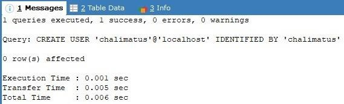
- Code :
  ```sql
  CREATE USER 'safira'@'localhost' IDENTIFIED BY 'safira';
  ```
  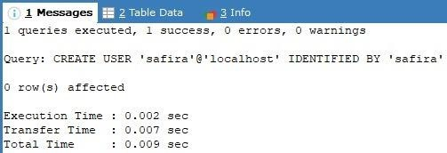
- Code :
  ```sql
  CREATE USER 'sherli'@'localhost' IDENTIFIED BY 'sherli';
  ```
  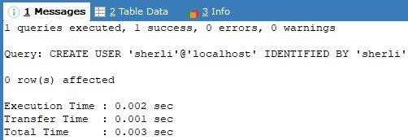
-	Menampilkan daftar user beserta host yang diizinkan untuk mengakses database.
- Code :
  ```sql
  SELECT USER, HOST FROM mysql.user WHERE USER IN ('chalimatus', 'safira', 'sherli');
  ```
  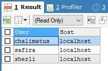

### 2. Lakukan penghapusan username terhadap user yang sudah dibuat. Tuliskan script dan tampilkan hasilnya

- Menghapus user sherli dari MySQL
- Code :
  ```sql
  DROP USER 'sherli'@'localhost';
  ```
  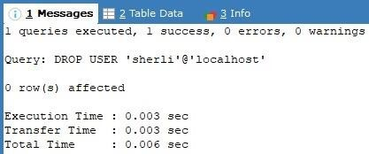
- Mengecek kembali daftar user yang masih ada setelah penghapusan user sherli.
- Code :
  ```sql
  SELECT USER, HOST FROM mysql.user WHERE USER IN ('chalimatus', 'safira', 'sherli');
  ```
  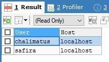

### 3. Buat role dengan "role_nama_anda_insert_select" -> role_andi_select_insert

-	Membuat role bernama role_chalimatus_insert_select.
-	Code :
  ```sql
  CREATE ROLE 'role_chalimatus_insert_select';
  ```
  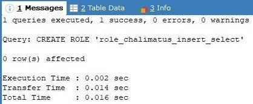

### 4. Berikan privilege select, insert ke dalam role di atas

-	Memberikan izin SELECT dan INSERT pada seluruh tabel di database_example untuk role role_chalimatus_insert_select.
-	Code :
  ```sql
  GRANT SELECT, INSERT ON database_example.* TO 'role_chalimatus_insert_select';
  ```
  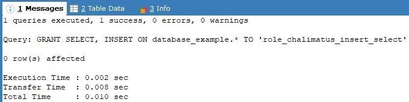
  
### 5. Buat role dengan "role_nama_anda_create_drop" -> role_andi_create_drop

-	Membuat role bernama role_chalimatus_create_drop.
-	Code :
  ```sql
  CREATE ROLE 'role_chalimatus_create_drop';
  ```
  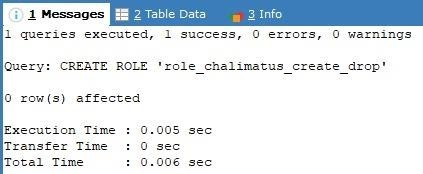
  
### 6. Berikan privilege create, drop kedalam role diatas

-	Memberikan izin CREATE dan DROP pada seluruh tabel di database_example untuk role role_chalimatus_create_drop.
-	Code :
  ```sql
  GRANT CREATE, DROP ON database_example.* TO 'role_chalimatus_create_drop';
  ```
  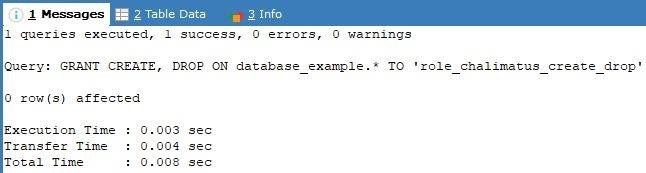
  
### 7. Berikan 2 user kedalam masing-masing role diatas.

-	Memberikan role role_chalimatus_insert_select kepada chalimatus dan safira.
-	Code :
  ```sql
  GRANT 'role_chalimatus_insert_select' TO 'chalimatus'@'localhost', 'safira'@'localhost';
  ```
  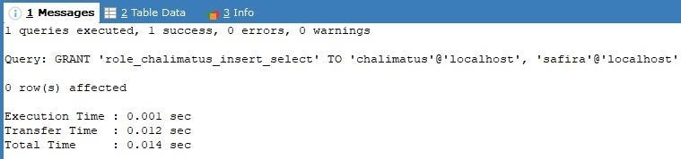

-	Mengecek kembali daftar user yang memiliki hak akses tertentu.
-	Code :
    ```sql
    SELECT USER, HOST FROM mysql.user WHERE USER IN ('chalimatus', 'safira', 'sherli');
    ```
  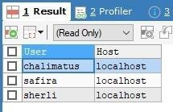

### 8. Lakukan pengujian sebelum dan sesudah user diberikan role.

-	Menampilkan daftar hak akses (privilege) yang dimiliki oleh user chalimatus dan safira.
-	Code :
  ```sql
  SHOW GRANTS FOR 'chalimatus'@'localhost';
  ```
  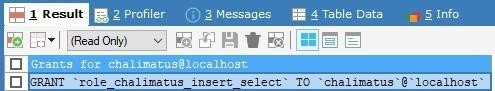
- Code :
  ```sql
  SHOW GRANTS FOR 'safira'@'localhost';
  ```
  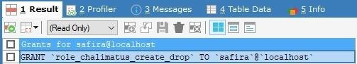
### 9. Lepas role dari user diatas. Sehingga user menjadi tidak memiliki role.
### 10. Lakukan konfigurasi untuk proses monitoring proses seperti contoh diatas, dan lakukan beberapa kali proses query. Kemudian lihat di log nya dan tampilkan hasilnya.
### 11.	Tulis kesimpulan dari kegiatan praktek kelompok anda.
