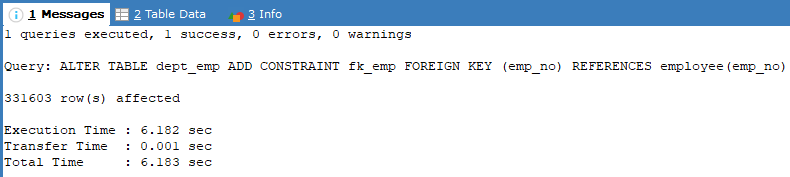

# PERFORMANCE

## Latar Belakang
Dalam pengelolaan basis data, performa eksekusi query menjadi faktor penting yang mempengaruhi efisiensi sistem. Salah satu cara meningkatkan performa adalah dengan penggunaan indeks yang tepat. Indeks memungkinkan database untuk mengambil data lebih cepat dibandingkan dengan pemindaian tabel penuh. Oleh karena itu, laporan ini membahas implementasi indeks dan pengaruhnya terhadap kecepatan eksekusi query.

## Problem yang Diangkat
Masalah utama dalam laporan ini adalah:
1. Bagaimana proses impor data ke dalam MySQL?
2. Bagaimana cara menganalisis performa eksekusi query dengan dan tanpa indeks?
3. Bagaimana pengaruh indeks terhadap kecepatan eksekusi query dalam basis data besar?
4. Bagaimana penggunaan indeks composite dan foreign key dapat membantu optimalisasi pencarian data?

## Solusi / Skenario Aktivitas
### 1.	Lakukan semua tahapan diatas, dan jalankan pada database anda. Tambahkan screenshot hasil dari setiap Langkah yang anda lakukan.
  - Jalankan query
    ```sql
    SELECT * FROM employee
    ```
    
    - Penjelasan:
      - Query ini digunakan untuk menampilkan semua data dari tabel employee. Tanda bintang (*) digunakan untuk menampilkan seluruh kolom yang ada di tabel tersebut.
 
  - Jalankan query explain
    ```sql
    EXPLAIN SELECT * FROM employee WHERE first_name = ‘Georgi’
    ```
    
    - Penjelasan:
      - Perintah EXPLAIN digunakan untuk menganalisis bagaimana MySQL menjalankan query. Hasil dari EXPLAIN akan menunjukkan apakah query melakukan Full Table Scan (memeriksa seluruh tabel) atau menggunakan index. Pada tahap ini, MySQL melakukan pemindaian penuh pada tabel karena belum ada index yang ditambahkan.
 
Dari hasil query explain terlihat, pada kolom key dan key len, tidak ada nama index yg diakses. Jadi bias disimpulkan query ini melakukan scan langsung ke seluruh table

  - Tambahkan index
    ```sql
    ALTER TABLE employee ADD INDEX idx_full_name (first_name, last_name)
    ```
    
    - Penjelasan:
      - Perintah ini menambahkan composite index pada kolom first_name dan last_name. Index ini membantu mempercepat pencarian data yang menggunakan kedua kolom tersebut dalam klausa WHERE.
 
  - Lakukan query explain lagi untuk query di atas
    ```sql
    EXPLAIN SELECT * FROM employee
    WHERE first_name = ‘Georgi’
    AND last_name = ‘Bahr’
    ```
    
    - Penjelasan:
      - Setelah index ditambahkan, query menggunakan index untuk mencari data, sehingga proses pencarian menjadi lebih cepat. Hal ini terlihat pada kolom key dan possible_keys pada hasil EXPLAIN yang menunjukkan bahwa index digunakan.
 
Sekarang bisa kita lihat bahwa query yang kita jalankan tidak lagi scaning penuh ketabel, melainkan akses pada index. Ini terlihat pada nilai kolom key dan possible_keys.

### 2. Tambahkan kolom nama departemen pada table dept_manager. Dan lakukan update terhadap kolom tersebut. Tambahkan screenshot hasilnya
  - Query:
    ```sql
    ALTER TABLE dept_manager ADD COLUMN nama_departemen VARCHAR(100);
    ```
    
    - Penjelasan:
      - Perintah ini digunakan untuk menambahkan kolom baru dengan nama nama_departemen bertipe VARCHAR(100) pada tabel dept_manager.
 
  - Query:
    ```sql
    UPDATE dept_manager SET nama_departemen = 'HR Departement' WHERE dept_no = 'd001';
    ```
    
    - Penjelasan:
      - Query ini digunakan untuk mengisi kolom nama_departemen  pada tabel dept_manager dengan nilai HR Departement pada baris yang memiliki dept_no = 'd001'.

### 3.	Tambahkan kolom nama departemen pada table dept_emp. Dan lakukan update terhadap kolom tersebut. Tambahkan screenshot hasilnya.
  - Query:
    ```sql
    ALTER TABLE dept_emp ADD COLUMN nama_departemen VARCHAR(100);
    ```
    
    - Penjelasan:
      - Perintah ini menambahkan kolom baru nama_departemen pada tabel dept_emp.

  - Query:
    ```sql
    UPDATE dept_emp SET nama_departemen = 'Marketing' WHERE dept_no = 'd002';
    ```
    
    - Penjelasan:
      - Query ini memperbarui kolom nama_departemen pada tabel dept_emp dengan nilai Marketing untuk data dengan dept_no = 'd002'.
 
### 4.	Buat query untuk menampilkan gaji yang tertinggi pada departemen d006. Siapa Namanya?
  - Query:
    ```sql
    SELECT e.first_name, e.last_name, s.amount
    FROM employee e
    JOIN salary s ON e.emp_no = s.emp_no
    JOIN dept_emp d ON e.emp_no = d.emp_no
    WHERE d.dept_no = 'd006'
    ORDER BY s.amount DESC
    LIMIT 1;
    ```
    
    - Penjelasan:
      - Query ini digunakan untuk menampilkan nama dan gaji tertinggi pada departemen dengan kode d006. Penjelasan:
        - JOIN  digunakan  untuk  menggabungkan  tabel  employee,  salary,  dan
dept_emp.
        - Kondisi WHERE digunakan untuk memfilter data berdasarkan departemen.
        - ORDER BY DESC digunakan untuk mengurutkan gaji dari yang tertinggi.
        - LIMIT 1 hanya menampilkan satu data dengan gaji tertinggi.

### 5.	Dari database employe yang sudah diimport, tambahkan kolom umur pada table employee. Kemudian lakukan update terhadap kolom umur tersbut. Nilai umur, dhitung dari tanggal lahir s.d sekarang. Tambahkan screenshot hasilnya.
  - Query:
    ```sql
    ALTER TABLE employee ADD COLUMN umur INT;
    ```
    
    - Penjelasan:
      - Perintah ini menambahkan kolom baru umur bertipe integer pada tabel employee.

  - Query:
    ```sql
    UPDATE employee SET umur = YEAR(CURDATE()) - YEAR(birth_date);
    ```
    
    - Penjelasan:
      - Perintah ini menghitung umur berdasarkan selisih tahun saat ini dengan tahun lahir dari kolom birth_date.
 
### 6.	Tambahkan masing-masing jenis index diatas composite index dan foreign key index pada table employee.
  - Query:
    ```sql
    ALTER TABLE employee ADD INDEX idx_nama (first_name, last_name);
    ```
    
  - Query:
    ```sql
    ALTER TABLE dept_emp ADD CONSTRAINT fk_emp FOREIGN KEY (emp_no) REFERENCES employee(emp_no);
    ```
    
    - Penjelasan:
      - Index ini digunakan untuk mempercepat pencarian data pada kolom first_name dan last_name, sedangkan foreign key digunakan untuk menjaga hubungan data antar tabel.

### 7.	Lakukan pengujian terhadap query berikut, apakah sudah mengakses index atau belum.
  ```sql
  EXPLAIN SELECT * FROM employee WHERE first_name = 'Georgi';.
  ```
  

### 8.	Lakukan pengujian dari query berikut. Apakah ada perbedaan sebelum dan sesudah ditambahkan index. Query untuk menguji:
  ```sql
  SELECT * FROM employee WHERE first_name = 'Georgi' AND last_name = 'Bahr';
  ```
  - Cara menguji,
    - Jalankan query diatas sebanyak 10x. catet waktunya setiap kali dijalankan.
      | No | Waktu (sec) |
      |----|------------|
      | 1  | 0.012      |
      | 2  | 0.012      |
      | 3  | 0.012      |
      | 4  | 0.012      |
      | 5  | 0.007      |
      | 6  | 0.013      |
      | 7  | 0.013      |
      | 8  | 0.013      |
      | 9  | 0.017      |
      | 10 | 0.009      |
      | **Total** | **0.120** |

    - Buat index composite yang bersesuaian dengan query diatas.
      - Query:
        ```sql
        ALTER TABLE employee ADD INDEX idx_nama (first_name, last_name);
        ```
        
    - Jalankan query diatas sebanyak 10x. catet waktunya setiap kali dijalankan.
      | No | Waktu (sec) |
      |----|------------|
      | 1  | 0.012      |
      | 2  | 0.012      |
      | 3  | 0.012      |
      | 4  | 0.013      |
      | 5  | 0.009      |
      | 6  | 0.010      |
      | 7  | 0.009      |
      | 8  | 0.013      |
      | 9  | 0.010      |
      | 10 | 0.013      |
      | **Total** | **0.113** |

    - Ambil rata2 sebelum dan sesudah.
      - Rata-rata: 0.1165 sec

    - Tulis kesimpulanya.
### Kesimpulan:
Berdasarkan hasil pengujian waktu eksekusi query sebelum dan sesudah penambahan index, didapatkan rata-rata waktu eksekusi sebagai berikut:

- Sebelum menggunakan index: 0.120 detik
- Sesudah menggunakan index: 0.113 detik

Dari hasil tersebut, terlihat bahwa setelah menambahkan index composite pada kolom first_name dan last_name, terjadi peningkatan performa dengan selisih rata-rata waktu eksekusi sebesar 0.007 detik lebih cepat.

Meskipun selisih waktu terlihat kecil, namun pada database dengan jumlah data yang besar, penggunaan index sangat membantu mempercepat proses pencarian data dan mengurangi beban sistem. Hal ini membuktikan bahwa penggunaan index pada database sangat efektif untuk meningkatkan efisiensi query.

## Pembahasan
Beberapa eksperimen yang dilakukan:
1. Analisis Query Tanpa Indeks
Query ```SELECT * FROM employee WHERE first_name = 'Georgi'``` dilakukan tanpa indeks. Hasil EXPLAIN menunjukkan bahwa MySQL melakukan pemindaian tabel penuh (Full Table Scan), yang kurang efisien.

2. Menambahkan Indeks
Composite index ditambahkan dengan perintah:
```ALTER TABLE employee ADD INDEX idx_nama (first_name, last_name);```
Setelah indeks ditambahkan, query yang sama diuji kembali, dan hasil EXPLAIN menunjukkan bahwa MySQL menggunakan indeks untuk pencarian, yang meningkatkan efisiensi.

3. Perbandingan Waktu Eksekusi Query
Query ```SELECT * FROM employee WHERE first_name = 'Georgi' AND last_name = 'Bahr'``` dijalankan sebanyak 10 kali sebelum dan sesudah indeks ditambahkan.

- Hasil:
  - Sebelum indeks: rata-rata 0.120 detik.
  - Sesudah indeks: rata-rata 0.113 detik.
  - Selisih waktu eksekusi menunjukkan peningkatan performa.

4. Penambahan Foreign Key
Menambahkan foreign key pada tabel dept_emp untuk menjaga integritas referensial:
```ALTER TABLE dept_emp ADD CONSTRAINT fk_emp FOREIGN KEY (emp_no) REFERENCES employee(emp_no);```

## Kesimpulan
Berdasarkan hasil pengujian:
1. Indeks mempercepat eksekusi query dengan mengurangi pemindaian tabel penuh.
2. Penggunaan composite index pada kolom yang sering digunakan dalam pencarian dapat meningkatkan performa secara signifikan.
3. Penambahan foreign key membantu menjaga integritas data antar tabel.

Meskipun peningkatan performa dalam percobaan ini tampak kecil, efeknya akan lebih signifikan pada database dengan jumlah data yang besar.
